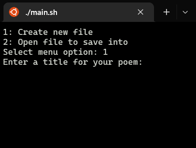

# Haiku Creator

## Liam Massey T1A3

***

### Repository and Video Link

[Video presentation](https://youtu.be/buRMeKvHnzo)
[Github repository](https://github.com/Liam-M-Dev/T1A3-terminal-app)  
***

### About the App

Haiku creator is a terminal app that you can use to create your own haiku poetry. The app it allows you to create a file to save your own haiku poems. You can create multiple files, access them to print out your poems to the terminal, edit poems and remove poems or the file itself.  
As an added extra there is a jumble mode that allows you to select a file with 2 or more poems and randomly mix/match the poems sentences to create new poems.  
This app has a feature to ensure you keep your haiku's within a certain amount of syllables. The first and third line are between 4-6 syllables and the second line is 6-8 syllables. The basic rule is 5-7-5 but I wanted to give a little leeway as it can be difficult to stick to that rule.  
Please refer to the help documentation to get a better understanding to install the app and how to use it.  
***

### System Requirements

To run this terminal app you will need:

- python version 3.10.8
- pip version 22 or higher
- pyenv for the virtual environment
- python packages
  - attrs==22.1.0
  - exceptiongroup==1.0.4
  - iniconfig==1.1.1
  - packaging==22.0
  - pluggy==1.0.0
  - pytest==7.2.0
  - syllapy==0.7.2
  - terminal==0.4.0
  - tomli==2.0.1

***

### Code Style Guide

For this terminal application I will be following the pep8 style guide.  
[pep8 style guide](https://peps.python.org/pep-0008/#copyright)  
***

### List of Features and Description  

List of features associated with the app:

- A clean menu with clear inputs for the user.
- Create a haiku allowing to create a new haiku and save it in a new file or within an already available file.
- An easy to use file system allowing editing and removing of files and poems within the file.
- A jumbler that jumbles the poems within a file and returns a fun mismatch of poems.

#### **Menu Feature**

The menu is a clean feature that will keep the screen clear of clutter when accessing the different options. It displays 5 options which are an intro section, the create haiku section, access saved files for editing, the jumble feature and a quit program feature. The user then selects the option by typing in the input section with the corresponding number.  

#### **Create a Haiku**

The create haiku is the main feature of this program. For this feature the user is able to create their own haikus and save them within a new file or a previously saved file. This feature is able to check the user inputs to ensure no incorrect values are provided and that each line follows the syllable rule. Users are prompted at the start to create a new file or use a saved file.  

#### **File System**

The file system is a feature that allows the users to handle the files and poems saved within a file. There are 3 main areas of this feature, creating a new file when it is chosen with creating a new haiku. Allowing users to open files and read the poems within, users can also edit the poems within the files. Lastly users are able to delete files and to delete poems within files.

#### **Jumbler**

The jumbler is a fun little feature in which the user can jumble the sentences within a saved file and return new mismatched poems. The jumbler will only accept a file with at least 2 or more poems within its contents. Once an appropriate file is chosen, the feature will rearrange the lines of the poems by swapping line 1s with line 1s, line 2s with line 2s and line 3s with line 3s. Returning a new set of mismatched poems this then allows the user to save the new list or return to the original file.  
**_note_:** While implementing my jumbler feature, I actually decided to stray a little from this plan and have the jumbler shuffling titles and all the lines from the poems up, producing a single poem from the jumble and giving the user the option to save to the file.

***

### Implementation Plan

The implementation plan for this project is as follows

I have created a Kaban work board to track my progress with the use of Trello boards. [link to website](https://trello.com/b/jaVpKf8J/haiku-terminal-app)

#### **Initial setup**

    - Set up repository both locally and remote
    - Set up venv within local repository
    - Install Syllapy package using pip (Syllapy package made by Michael Holtzscher)

#### **Menu creation** - partial deadline by 10th December 11pm, full deadline by 14th December 11pm

- Set up main menu using a while loop - deadline 8th December 11pm
- Set up main menu options function. prints out options for main menu and takes user input
- Enable error handling - deadline 10th December 11pm

#### **Intro** - deadline 8th of December 11pm

- Create intro function
- Write out print statements that introduce user to app

#### **Create haiku feature** - deadline by 11th of December 11pm

- Implement menu selection for creating a new file or opening a previously saved file
- Implement function that takes user input for 3 lines
- Implement function that checks user input following the 5-7-5 rule
- Implement save or redo function that saves the haiku to the file or lets user try again
- Incorporate error handling
- Write tests for all functions to ensure working appropriately
- Ensure there is a way for the user to go back to the main menu (an exit)

#### **File system** - deadline 12th of December 11pm

- Implement function that creates a new .JSON file
- Implement function that allows user to open saved files path and choose to open a file to read, edit or remove
- Implement function that allows user to select a haiku from the file to view, edit or remove
- Ensure error handling and testing is done to confirm feature is behaving as intended

#### **Jumbler feature** - deadline 14th of December 11pm

- Implement function that asks user to choose the file to jumble
- Implement logic to ensure file has 2 or more haiku poems within
- Implement logic that takes the chosen file and jumbles all of the contents of the poems up
- Once jumbled ensure that user is returned with new jumbled poems to view
- Ensure user is asked if they wish to save poems before removing old file data

#### **Tests**

- Implement tests for two features with multiple test cases, one for creating haiku poems and other for file system

#### **Miscellaneous tasks**

- Write up help file that explains all system requirements, how to install various packages and os related information and a useful help file for how to run the program itself including script execution from bash. Deadline Thursday 15th of December
- Finalize documentation aka clean all this up and make it readable. Deadline Thursday 15th of December
- Create slide deck and film presentation. Deadline Friday 16th of December

**Deadline for my project is to have all this finished by Friday the 16th of December to allow for a few days of going through and double checking everything is good for submission.**  

***

### Testing procedure

For an outline of the testing procedure please follow this [link](./src/testingprocedure.md)
***

### Help Documentation  

#### **Installation**  

1) Clone from repository this can be done by git clone git@github.com:Liam-M-Dev/T1A3-terminal-app.git  
2) Once cloned make the bash scripts executable by typing chmod +x main.sh python-pip-install.sh venv-install.sh  
3) Next run the python-pip-install script to ensure you have python and pip installed and the correct versions, python version = 3.10.8, pip version = 22 and up  
4) If you do not have python or pip installed follow these guides: [pip](https://pip.pypa.io/en/stable/installation/), [python](https://installpython3.com/)  
5) Now to set up your virtual environment, run the venv-install script which will do the heavy lifting for you
6) If you prefer to set up manually then firstly make sure you have pyenv installed by typing ```command -v pyenv```, if it is not installed then follow this [guide](https://k0nze.dev/posts/install-pyenv-venv-vscode/#linux-debianubuntu) by Konstantin Lübeck
7) Once pyenv is installed, set the python version for the local repository by typing ```pyenv local python 3.10.8``` in the terminal
8) Now create a python virtual environment by typing ```python -m venv .venv``` or ```python3 -m venv .venv```
9) Activate the virtual environment by typing ```source venv/bin/activate``` and install from package requirements with ```pip3 install -r requirements.txt```
10) Installation is complete, you can now run the terminal app by inputting ```./main.sh``` in the terminal

#### **How to use haiku creator**  

Haiku creator is an easy to use application and following these steps will ensure that you have no issues with operating the app.  
When first starting the app, you will be presented with a menu with 5 options,

- intro
- haiku creator
- saved files
- jumbler
- quit

To choose an option from the menu simply type its related number into the terminal and hit enter.
_Note that there is a back feature for all input sections in which if you type back into the terminal and hit enter, it will take you back to the main menu._  

The Intro section has a helpful introduction to what a haiku is and how to use the app.  
The haiku creator option allows you to choose to create a new file or save to a previous file.  

#### **Create a haiku**

When selecting create a new file, firstly you will have to make your haiku. This is done by typing into the terminal when prompted. You will create a title, then the lines, each line will check your syllables and allow you to continue if its in the approved amount, for line 1 and 3 it is 4-6 syllables and for line 2 it is 6-8 syllables.  
The program will then ask you if you would like to save, by typing either y or n you can either save the poem or return to the menu.  
When saving the poem is selected, you will be prompted to type in a name for the file, with your file name, avoid using special characters and just type the name as the app will save it as a .json file.  
When saving a new poem to a previous file, the only difference here is that you will be prompted to select the file you would like to save into, to do this type out the full name of the file including .json.

#### **Saved files**

The saved files menu option gives you three choices, view your poems from a file, edit poems within a file and delete a file.  
You can access these options by typing in the corresponding number.

- viewing your files will print out the poems from a file you choose to the terminal screen
- Editing poems, will prompt you to type in the name of the file you wish to edit, then the program will print out the available poem titles
- You can select a poem by typing the title in the terminal, then you will be prompted to choose a line to edit, editing is the same process as creating where you will type the new line you want and it will check the syllables before accepting. Once you are done editing, type done into the terminal to save and exit
- To delete a file simply enter a file name that you wish to delete, then confirm by typing "y" in the terminal  

#### **Jumbler feature**

The jumbler is a fun little game that will mash together your titles and lines and generate a new poem that you can choose to save or retry.  
To use this feature, access it via the menu and then type the file name that you wish to select, the program will check the amount of poems within the file, if the file has 2 or more poems then it will randomly generate a new poem with the contents, if not it will tell you to try again with a new file.  

#### **Helpful features**  

There's really only 2 features I need to reiterate to ensure smooth usage of the app. Firstly at any input prompt you can type back and it will return you to the main menu. To exit the program you need to type 5 in at the main menu to select the quit option.  

That's all, have fun creating haiku poems!
***

### Screenshots  





***

### Reference List

#### **Poems**

the three poems saved in the sample poems file are

1) Even in Kyoto - Matsuo Basho
2) Over the Wintry - Natsume Soseki
3) Lines on a Skull - Ravi Shanker
